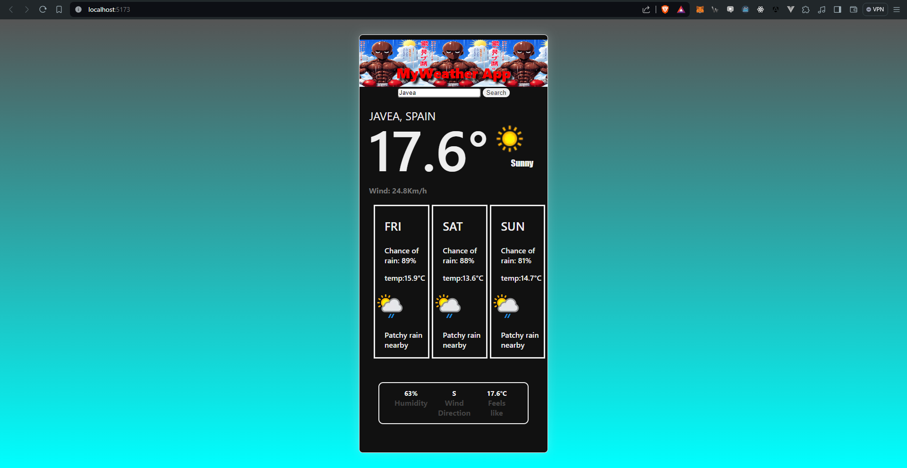

# The provided code showcases a basic example of a web application using Svelte, a JavaScript framework for building interactive user interfaces. Here's a brief description of what each part of the code does:

## JavaScript (Svelte Component):
Imports the onMount function and data retrieval functions (getWeather and getFuture) from the corresponding files.
Defines variables to store current weather data (weatherData) and future forecast (weatherFuture).
Defines a function to get the day of the week from a date (getDayOfWeek).
Defines a function to search for weather when the search button is clicked (searchWeather).
Uses the onMount function to load weather data when the component mounts.

## Styles (CSS):
Defines styles for various HTML elements, such as sections (section), headers (h1, h2, h3, h4, h6), and inputs (input).
Sets layout styles, font sizes, colors, and margins to enhance the appearance of the application.

## HTML (Svelte Template):
Uses conditionals ({#if}) to display different parts of the interface depending on whether weather data is available or not.
Displays the application name, a text input field for searching cities, a button to perform the search, and different sections to show current and future weather data.
Uses loops ({#each}) to iterate over future forecast data and display it in the interface.
Includes a footer component (WeatherFooter) that shows additional information about the current weather.
In summary, this code combines JavaScript, CSS, and HTML to create a simple web application that displays current weather and future forecast for a specific location. It leverages Svelte to handle UI logic and presentation efficiently.
